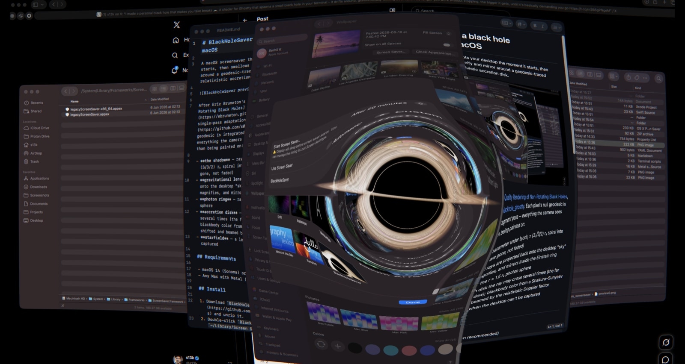

# BlackHoleSaver — macOS 黑洞屏保

屏保启动时截取你的桌面，然后把它吞进黑洞——窗口在史瓦西黑洞周围弯曲、放大、镜像，配上相对论吸积盘。



基于 Eric Bruneton 的 [Real-time High-Quality Rendering of Non-Rotating Black Holes](https://ebruneton.github.io/black_hole_shader/)，经 [blackhole_ghostty](https://github.com/s0xDk/blackhole_ghostty) 的单 pass 改造。每个像素的零测地线在一个 Metal fragment pass 中数值积分——你看到的一切都来自光线追踪：

- **黑洞阴影** —— 碰撞参数小于 b₍crit₎ = (3√3/2) rₛ 的光线螺旋坠入视界（你的窗口真的消失了，不是淡出）
- **引力透镜** —— 逃逸光线投射回桌面"天空"平面：截图在爱因斯坦环内弯曲、放大、镜像
- **光子环** —— 缠绕在 r = 1.5 rₛ 光子球附近的光线
- **吸积盘** —— 光线可多次穿越的薄开普勒盘（远侧弧线在阴影上下方）；Shakura–Sunyaev 温度分布的黑体色，经相对论多普勒因子频移和束流增强
- **星空** —— 无法截取桌面时显示的透镜星空

## 系统要求

- macOS 14 (Sonoma) 及以上
- 支持 Metal 的 Mac（推荐 Apple Silicon）

## 安装

1. 从 [Releases](https://github.com/Qsker/blackhole_screensaver_macos/releases) 下载 `BlackHoleSaver.saver.zip` 并解压
2. 双击 `BlackHoleSaver.saver` —— 自动安装到 `~/Library/Screen Savers/`
3. 在 **系统设置 → 屏幕保护程序** 中选择 **BlackHoleSaver**
4. 授予屏幕录制权限（见下节）—— 没有权限的话黑洞吞的是星空而非桌面

如果 macOS 拒绝打开通过其他渠道获取的副本，清除隔离标记：

```bash
xattr -dr com.apple.quarantine BlackHoleSaver.saver
```

## 屏幕录制权限

截取桌面需要**屏幕录制**权限。第三方屏保运行在 Apple 的系统进程中，权限需要授予宿主进程而非屏保 bundle 本身。**不同 macOS 版本的宿主进程不同：**

### macOS 27

宿主进程为 `WallpaperAgent.app`（普通的 `.app`，可以直接通过 "+" 添加）：

1. 打开 **系统设置 → 隐私与安全性 → 屏幕与系统音频录制**
2. 点击 **+** → 前往 `/System/Library/CoreServices/`
3. 选择 **WallpaperAgent.app** → 打开 → 打开开关
4. 终端执行 `killall WallpaperAgent`（或注销重新登录）

### macOS 14 / 15

宿主进程为 `legacyScreenSaver.appex`（`.appex` 扩展，"+ " 按钮无法选取，需要拖拽）：

1. 打开 **系统设置 → 隐私与安全性 → 屏幕与系统音频录制**
2. 在 Finder 中 **前往 → 前往文件夹…**（<kbd>⇧⌘G</kbd>），粘贴：

   ```
   /System/Library/Frameworks/ScreenSaver.framework/PlugIns/
   ```

3. 将 **`legacyScreenSaver.appex`** 从 Finder 窗口拖入权限列表，打开开关
4. 终端执行 `killall legacyScreenSaver`（或注销重新登录）

> 💡 也可以运行仓库中的 `fix-permissions.sh` 获取交互式帮助。

## 设置与预设

系统设置 → 屏幕保护程序 → BlackHoleSaver → **选项…**：

| 选项 | 说明 |
|---|---|
| **预设** | 炼狱（默认）、卡冈图雅、M87\* 甜甜圈、正面余烬、类星体、耀变体、纯透镜（无盘，纯几何 + 星空）、禅意 |
| **黑洞大小** | 阴影外观半径，最小占屏幕约 1.5%，最大约 12% |
| **漂移速度** | 黑洞漂移快慢（0 = 静止居中） |
| **扭曲范围** | 桌面可见弯曲范围（以黑洞半径为单位），最大值几乎覆盖全屏 |
| **画质** | 渲染缩放。自动（推荐）限制 1800 行，动态画面无感知差异且 5K/6K 屏保持流畅；可选手动覆盖 |

## 休息计时器（菜单栏工具）

`BlackHoleTimer.app` 是可选菜单栏伴侣：设定倒计时，时间到了自动启动屏保——真正让你停下来休息，因为工作直接掉进黑洞里了。

- 预设 5 到 60 分钟，或**自定义**任意时长
- 运行时菜单栏图标显示实时倒计时
- **重复**：休息后自动重新开始计时
- **登录时启动**：开机自启
- **立即显示黑洞**：跳过计时直接启动屏保
- 如果 Mac 在截止时间后从睡眠唤醒，不会立即触发

安装：从 [Releases](https://github.com/Qsker/blackhole_screensaver_macos/releases) 下载解压，拖入 `/Applications` 即可。

## 从源码构建

```bash
# 前置条件：Xcode 16+、Homebrew
brew install xcodegen
git clone https://github.com/Qsker/blackhole_screensaver_macos.git
cd blackhole_screensaver_macos
./build.sh
```

构建脚本会自动安装到 `~/Library/Screen Savers/`。也可手动构建：

```bash
xcodegen generate
xcodebuild -project BlackHoleSaver.xcodeproj -scheme BlackHoleSaver -configuration Release build
cp -R build/Build/Products/Release/BlackHoleSaver.saver ~/Library/Screen\ Savers/
codesign --force --sign - ~/Library/Screen\ Savers/BlackHoleSaver.saver
killall WallpaperAgent
```

> ⚠️ 构建后务必重新签名（`codesign --force --sign -`），否则 ad-hoc 签名的时间戳不匹配会导致 macOS 内核拦截代码页，屏保无法正常工作。

## 致谢

- [Eric Bruneton 的黑洞 shader](https://ebruneton.github.io/black_hole_shader/) —— 渲染方法
- [blackhole_ghostty](https://github.com/s0xDk/blackhole_ghostty) —— 单 pass 数值积分方案与吸积盘模型
